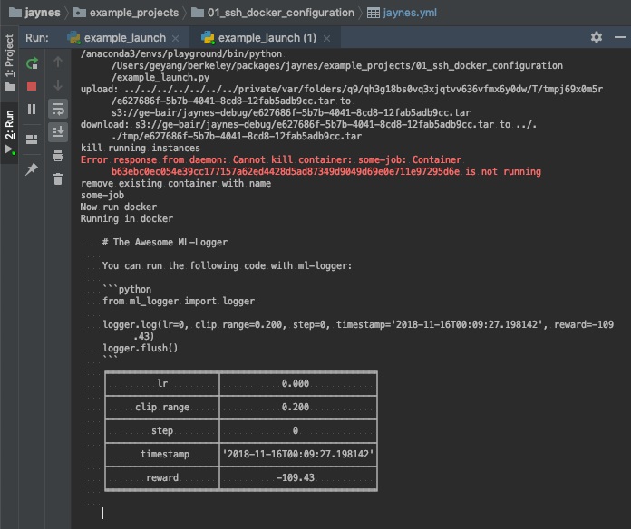

# Launching on Remote Server via SSH with `Jaynes`

This folder contains a working example for launching jobs on a remote work station via ssh (without docker)

result looks like:



## Temp Note:

jaynes```` uses gnu-tar and an updated version of rsyn on Mac OS. To install these, run
```bash
brew install gnu-tar
brew install rsync
```

## Getting Started

[will finish after lunch]

1. install `jaynes` and `cloudpickle==1.3.0` on both your local computer (where you run jaynes), and the docker image. This script installs these automatically, but you can comment that out if it is already installed.
2. run `lanch_entry.py`. 
3. go to [./secret.yml](.secret.yml) file and edit the user names and addresses of the remote workstation you are trying to connect and run scripts on

When you run the [./launch_entry.py](launch_entry.py) script, it generates two pieces of script:

**1. A Local Script**

```bash
type gtar >/dev/null 2>&1 && alias tar=`which gtar`
mkdir -p '/private/var/folders/q9/qh3g18bs0vq3xjqtvv636vfmx6y0dw/T/tmpl5cmntgw'
# Do not use absolute path in tar.
tar --exclude='*__pycache__' --exclude='*.git' --exclude='*.idea' --exclude='*.egg-info' --exclude='*.pkl' -czf '/private/var/folders/q9/qh3g18bs0vq3xjqtvv636vfmx6y0dw/T/tmpl5cmntgw/3e95eff1-e180-49a4-ae6c-b88cdaa965d6.tar' -C '/Users/geyang/berkeley/packages/jaynes/example_projects/01_ssh_docker_configuration/.' .
aws s3 cp '/private/var/folders/q9/qh3g18bs0vq3xjqtvv636vfmx6y0dw/T/tmpl5cmntgw/3e95eff1-e180-49a4-ae6c-b88cdaa965d6.tar' 's3://ge-bair/jaynes-debug/3e95eff1-e180-49a4-ae6c-b88cdaa965d6.tar' --acl public-read-write
```

and 

**2. A Remote Host Script**

```bash
#!/bin/bash
# to allow process substitution
set +o posix

mkdir -p /afs/csail.mit.edu/u/g/geyang/jaynes-demo/2021-02-17/122900.578234
JAYNES_LAUNCH_DIR=/afs/csail.mit.edu/u/g/geyang/jaynes-demo/2021-02-17/122900.578234

{
# upload_script from within the host.
# todo: include this inside the runner script.

            # sudo service docker start # this is optional.
            # docker pull python:3.7

            # export PATH=/usr/local/bin/:$PATH  # this is needed on mac osx hosts.
            echo `which docker`
            
            echo -ne 'kill running instances '
            docker kill jaynes-docker-demo
            echo -ne 'remove existing container '
            LANG=utf-8 docker rm jaynes-docker-demo
            
            echo 'Now run docker'
            LANG=utf-8 docker run -i  --ipc=host -v '/afs/csail.mit.edu/u/g/geyang/jaynes-demo/2021-02-17/122900.578234-jaynes_demo':'/Users/ge/mit/jaynes-starter-kit/01_ssh_docker_configuration/.' --name 'jaynes-docker-demo' \
            python:3.7 /bin/bash -c 'echo "Running in docker";yes | pip install jaynes==0.6.0rc16 ml-logger cloudpickle==1.3.0 -q;export PYTHONPATH=$PYTHONPATH:/Users/ge/mit/jaynes-starter-kit/01_ssh_docker_configuration/.;cd '/Users/ge/mit/jaynes-starter-kit/01_ssh_docker_configuration';JAYNES_PARAMS_KEY=gASVqQIAAAAAAAB9lCiMBXRodW5rlIwXY2xvdWRwaWNrbGUuY2xvdWRwaWNrbGWUjA5fZmlsbF9mdW5jdGlvbpSTlChoAowPX21ha2Vfc2tlbF9mdW5jlJOUaAKMDV9idWlsdGluX3R5cGWUk5SMCENvZGVUeXBllIWUUpQoSwJLAEsCSwVLQ0ModABkAXwBmwBkAnwAmwCdBIMBAQB0AGQDgwEBAHQAZASDAQEAZABTAJQoTowPdHJhaW5pbmcgbW9kZWwglIwGIHdpdGgglIwDLi4ulIwRVGhpcyBpcyB3b3JraW5nISGUdJSMBXByaW50lIWUjAJscpSMCm1vZGVsX25hbWWUhpSMTC9Vc2Vycy9nZS9taXQvamF5bmVzLXN0YXJ0ZXIta2l0LzAxX3NzaF9kb2NrZXJfY29uZmlndXJhdGlvbi9sYXVuY2hfZW50cnkucHmUjAZsYXVuY2iUSwFDBgABFAEIAZQpKXSUUpRK/////32UKIwLX19wYWNrYWdlX1+UTowIX19uYW1lX1+UjAhfX21haW5fX5SMCF9fZmlsZV9flIxML1VzZXJzL2dlL21pdC9qYXluZXMtc3RhcnRlci1raXQvMDFfc3NoX2RvY2tlcl9jb25maWd1cmF0aW9uL2xhdW5jaF9lbnRyeS5weZR1h5RSlH2UKIwHZ2xvYmFsc5R9lIwIZGVmYXVsdHOUjAVMZU5ldJSFlIwEZGljdJR9lIwOY2xvc3VyZV92YWx1ZXOUTowGbW9kdWxllGgfjARuYW1llGgYjANkb2OUTowXX2Nsb3VkcGlja2xlX3N1Ym1vZHVsZXOUXZSMCHF1YWxuYW1llGgYjAprd2RlZmF1bHRzlE51dFKMBGFyZ3OUKYwGa3dhcmdzlH2UaBRHP1BiTdLxqfxzdS4= python -u -m jaynes.entry'

}  > >(tee -a /afs/csail.mit.edu/u/g/geyang/jaynes-demo/2021-02-17/122900.578234/jaynes-launch.log) 2> >(tee -a /afs/csail.mit.edu/u/g/geyang/jaynes-demo/2021-02-17/122900.578234/jaynes-launch.err.log >&2)
```

Then when you call `jaynes.run(fn, **keyword_arguments)`, `jaynes` sends the remote script to your remote host (the computer on which you want to run the job), and executes this script.

You can peek at this script by setting `verbose=True` in the `jaynes.config` call, or you can add that to the yaml file.

Now, the result is piped back via ssh to your computer at real time:


