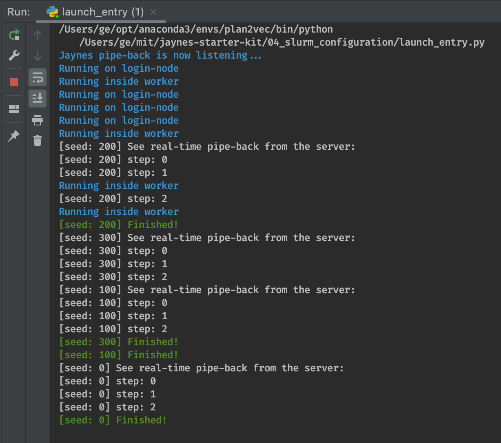

<a href="./figures/slurm_stdout_3.png" target="_blank"></a>

# SLURM Setup [via SSH]

`jaynes` supports two SLURM launch modes. In the first mode, `jaynes` ssh tunnel through each time when you call `jaynes.run(train_fn)`. In the second model, we setup a `jaynes.server` instance on the SLURM cluster's login node, which we can control via TCP/IP callls. 

Depending on your cluster's admin policy and access configuration, one of these two modes would be more suitable. HPC admins can decide to offer a managed `jaynes.server`  endpoint where they provide token-based access.

In this tutorial, we will provide guide on the [ssh] launch model. For the client/server launch model, refer to [../05_client_server](../05_client_server) instead.

## Getting Started

First make sure that you can access the login node of your cluster:

```bash
ssh $JYNS_USERNAME@$JYNS_SLURM_HOST -i $JYNS_PEM
```

to do so, you need to configure these in your environment script `./bashrc`

```bash
export JYNS_SLURM_HOST=/*your username*/
export JYNS_USERNAME=/*your username*/
export JYNS_PEM=~/.ssh//*your rsa key*/
export JYNS_DIR=/*path to the NFS you have access to*/
```

> password login are usually disabled on managed SLURM clusters.

### Main Script

```python
import jaynes

def train_fn():
    from time import sleep

    for i in range(10):
        print(f"step: {i}"); sleep(0.1)
    print('Finished!')

if __name__ == "__main__":
    jaynes.config(verbose=False)
    jaynes.run(train_fn)

    jaynes.listen(200)
```

## Managing Python Environment on A SLURM Cluster

Docker are usually not supported on managed HPC clusters, where a shared, NFS offer direct access to common python environments across machines. We assume that you have installed conda, and there is a `base` environment available.

First, let's installl `jaynes`, this is because jaynes use the `jaynes.entry` module to bootstrap the launch after the job starts. In most cases, you want to install all packages in your user space, which is why we pass in the `--user` flag.

```bash
conda activate base
pip install --user jaynes
```

The launch `.jaynes.yml` file contains the following values for configuring the remote python runtime. You can tweak this until your code runs.

```yaml
- !runners.Slurm &slurm
  envs: >-
    LC_CTYPE=en_US.UTF-8 LANG=en_US.UTF-8 LANGUAGE=en_US
  startup: >-
    source ~/.bashrc;
    module load cuda/11.0;
    module load anaconda/2020b;
    source activate base;
```

## Launchiong Multiple Jobs

Just call `jaynes.run` with multiple copies of the function:

```python
#! ./multi_launch.py
import jaynes
from launch_entry import train_fn

if __name__ == "__main__":
    jaynes.config(verbose=False)

    for i in range(3):
        jaynes.run(train_fn, seed=i * 100)

    jaynes.listen(200)
```

And the output should be 3 streams of stdout pipe-back combined together, running in parallel.

```bash
/Users/ge/opt/anaconda3/envs/plan2vec/bin/python /Users/ge/mit/jaynes-starter-kit/04_slurm_configuration/launch_entry.py
Jaynes pipe-back is now listening...
Running on login-node
Running inside worker
Running on login-node
Running on login-node
Running on login-node
Running inside worker
[seed: 200] See real-time pipe-back from the server:
[seed: 200] step: 0
[seed: 200] step: 1
Running inside worker
[seed: 200] step: 2
Running inside worker
[seed: 200] Finished!
[seed: 300] See real-time pipe-back from the server:
[seed: 300] step: 0
[seed: 300] step: 1
[seed: 300] step: 2
[seed: 100] See real-time pipe-back from the server:
[seed: 100] step: 0
[seed: 100] step: 1
[seed: 100] step: 2
[seed: 300] Finished!
[seed: 100] Finished!
[seed: 0] See real-time pipe-back from the server:
[seed: 0] step: 0
[seed: 0] step: 1
[seed: 0] step: 2
[seed: 0] Finished!
```

## Issues and Questions?

Please report issues or error messages in the issues page of the main `jaynes` repo: [jaynes/issues](https://github.com/geyang/jaynes/issues). 

Happy Researching!  :heart: