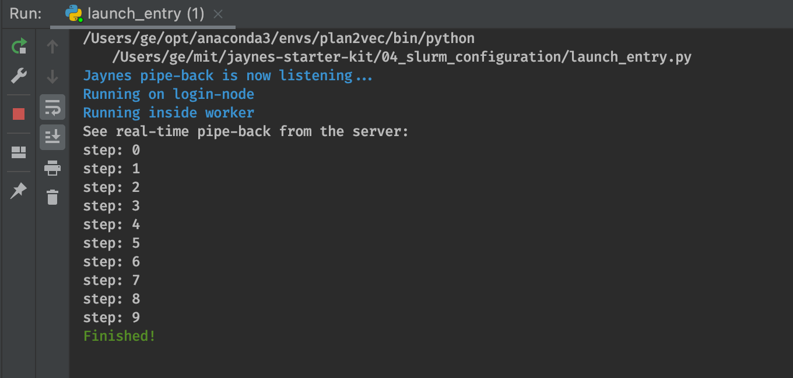

# SLURM Setup (MIT Supercloud) [via SSH]


`jaynes` supports two SLURM launch modes. In the first mode, `jaynes` ssh tunnel through each time when you call `jaynes.run(train_fn)`. In the second model, we setup a `jaynes.server` instance on the SLURM cluster's login node, which we can control via TCP/IP callls. 

Depending on your cluster's admin policy and access configuration, one of these two modes would be more suitable. HPC admins can decide to offer a managed `jaynes.server`  endpoint where they provide token-based access.

In this tutorial, we will provide guide on the [ssh] launch model. For the client/server launch model, refer to [../05_client_server](../05_client_server) instead.

# Using Python on the Cluster

**Note specific to MIT Supercloud**
The shared NFS file system is often a major bottleneck in a HPC network. To speed up the setup, the supercloud admin replicates the common modules locally within each worker. This is why on the MIT supercloud, we suggest you to stick with the conda environment provided via `module load <xxx>`.

On supercloud, `import torch` in a custom conda environments takes 87 seconds, whereas using the `module anaconda/2022b` takes 91.

Basical module commands are:

- to see all available modules: `module avail`
- to load a module: `module load <module name>`
- to list modules that you have loaded `module list`
- and to remove all modules: `module purge`

With jaynes, we can put this type of setup commands in the `runner.setup` field.

```bash
# to make the `module` command available
source /etc/profile.d/modules.sh
source $HOME/.bashrc
module load cuda/11.3
module load anaconda/2022b
# to add proxy setup, see note on setting up proxy
source ~/proxy.env
```

## Getting Started

**Note:** for the older setup that relies on environment variables, refer to [old_env_setup.md](old_env_setup.md).

### Installing Jaynes and ML-Logger

```bash
pip install jaynes ml-logger
```

`jaynes` reads a local `.secret.yml` file for variables to fill in. We provide a `.secret.template.yml` file in this directory. First copy this template file into 
```bash
cp .secret.yml .secret.template.yml
```
Then edit the secret file with your own configurations:
```yaml
JYNS_USERNAME: <your username on the cluster>
JYNS_SLURM_HOST: txe1-login.mit.edu
JYNS_SLURM_DIR: /home/gridsan/<your username>/jaynes-mount
JYNS_SLURM_PEM: /Users/<your username>/.ssh/<your key>
```

### Setting up ML-Logger

```bash
export ML_LOGGER_ROOT=<your-logging-url>
export ML_LOGGER_USER=<your-username>  # pick what you like
export ML_LOGGER_TOKEN=  # leave this empty for now.
export ML_LOGGER_S3_BUCKET=<bucket-name>  # optional
```

#### Note on Proxy [Supercloud Specific]
Outbound HTTP requests are blocked on the workers nodes in supercloud, which means you can not run pip install or send logging request to our ec2 instrumentation server. The admins have kindly offered us a way to set up proxy servers. [[Proxy Setup Supercloud]](../05_slurm_supercloud_mujoco/proxy_setup_supercloud.md)

## Managing Python Environment on A SLURM Cluster

Docker are usually not supported on managed HPC clusters, where a shared, NFS offer direct access to common python environments across machines. We assume that you have installed conda, and there is a `base` environment available.

First, let's installl `jaynes`, this is because jaynes use the `jaynes.entry` module to bootstrap the launch after the job starts. In most cases, you want to install all packages in your user space, which is why we pass in the `--user` flag.


The launch `.jaynes.yml` file contains the following values for configuring the remote python runtime. You can tweak this until your code runs.

```yaml
- !runners.Slurm &slurm
  envs: >-
    LC_CTYPE=en_US.UTF-8 LANG=en_US.UTF-8 LANGUAGE=en_US
  startup: >-
    source /etc/profile.d/modules.sh
    source $HOME/.bashrc
    module load cuda/10.2
    module load anaconda/2021a
    module load mpi/openmpi-4.0
```

**Note:** if you are not using supercloud and is using your own conda environments, replace the module load lines above below with your own conda, for example
```bash
conda activate base
pip install --user jaynes
```

This folder is structured as:

```bash
04_slurm_configuration
├── README.md
├── figures
└── launch_entry.py
```

Where the main file contains the following

### Main Script

```python
import jaynes

def train_fn(seed=100):
    from time import sleep

    print(f'[seed: {seed}] See real-time pipe-back from the server:')
    for i in range(3):
        print(f"[seed: {seed}] step: {i}")
        sleep(0.1)

    print(f'[seed: {seed}] Finished!')

if __name__ == "__main__":
    jaynes.config(verbose=False)
    jaynes.run(train_fn)

    jaynes.listen(200)
```

when you run this script, it should print out

<p></p>


## Common Errors

1. mismatching `cloudpickle` versions between local and remote
   ```error
   data = cloudpickle.loads(base64.b64decode(code))
   AttributeError: Can't get attribute '_make_function' on <module 'cloudpickle.cloudpickle' from '/home/gridsan/geyang/.local/lib/python3.8/site-packages/cloudpickle/cloudpickle.py'>
   ```
   If you check your local python environment, the `cloudpickle` version is probably wrong
   ```error
   >>> pip show cloudpickle
   Name: cloudpickle
   Version: 2.2.0 
   ```
   You can fix it via
   ```bash
   pip install cloudpickle==1.3.0
   ```

## Interactive vs Batch Jobs

When the `interactive` flag is `true`, we launch via the `srun` command. Otherwise, we pipe the bash script into a file, and launch using `sbatch`.

## Launching Multiple Jobs (Interactive)

Just call `jaynes.run` with multiple copies of the function:

```python
#! ./multi_launch.py
import jaynes
from launch_entry import train_fn

if __name__ == "__main__":
    jaynes.config(verbose=False)

    for i in range(3):
        jaynes.run(train_fn, seed=i * 100)

    jaynes.listen(200)
```

And the output should be 3 streams of stdout pipe-back combined together, running in parallel.

```bash
/Users/ge/opt/anaconda3/envs/plan2vec/bin/python /Users/ge/mit/jaynes-starter-kit/04_slurm_configuration/launch_entry.py
Jaynes pipe-back is now listening...
Running on login-node
Running inside worker
Running on login-node
Running on login-node
Running on login-node
Running inside worker
[seed: 200] See real-time pipe-back from the server:
[seed: 200] step: 0
[seed: 200] step: 1
Running inside worker
[seed: 200] step: 2
Running inside worker
[seed: 200] Finished!
[seed: 300] See real-time pipe-back from the server:
[seed: 300] step: 0
[seed: 300] step: 1
[seed: 300] step: 2
[seed: 100] See real-time pipe-back from the server:
[seed: 100] step: 0
[seed: 100] step: 1
[seed: 100] step: 2
[seed: 300] Finished!
[seed: 100] Finished!
[seed: 0] See real-time pipe-back from the server:
[seed: 0] step: 0
[seed: 0] step: 1
[seed: 0] step: 2
[seed: 0] Finished!
```

## Launching Sequential Jobs with `SBatch`
To submit a sequence of jobs with sbatch, 

1. turn off the `interactive` mode by setting it to `false`. 
2. specify `n_seq_jobs` to be > 1 (default: `null`).
3. make sure you set a job name, because otherwise, all of your `sbatch` calls will be sequentially ordered.

For example, `.jaynes.yml` may look like:

```yaml
- !runners.Slurm &slurm
  envs: >-
    LC_CTYPE=en_US.UTF-8 LANG=en_US.UTF-8 LANGUAGE=en_US
  startup: >-
    source /etc/profile.d/modules.sh
    source $HOME/.bashrc
  interactive: false
  n_seq_jobs: 3
```

Then, just call `jaynes.run(train_fn)` once:
```python
#! ./seq_jobs_launch.py
import jaynes
from launch_entry import train_fn

if __name__ == "__main__":
    for index in range(10):
        jaynes.config(verbose=False, launch=dict(job_name=f"unique-job-{index}"))
        jaynes.run(train_fn)
```
This runs `sbatch --job-name unique-job-0 -d singleton ...` for `n_seq_jobs=3` times, which requests sequential jobs.


## Issues and Questions?

Please report issues or error messages in the issues page of the main `jaynes` repo: [jaynes/issues](https://github.com/geyang/jaynes/issues). 

Happy Researching!  :heart:
