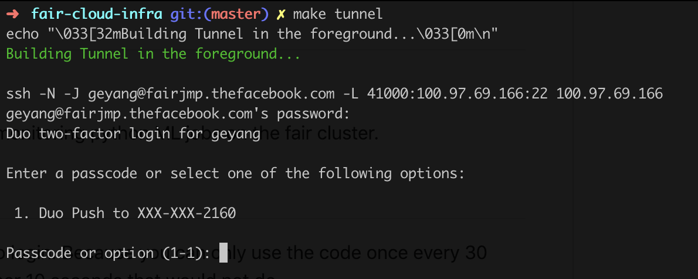
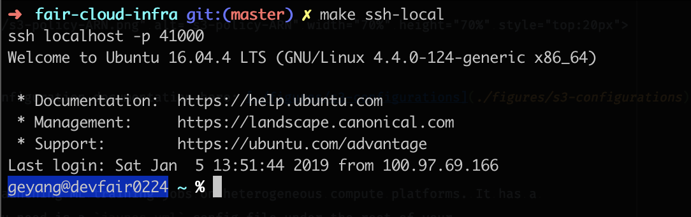
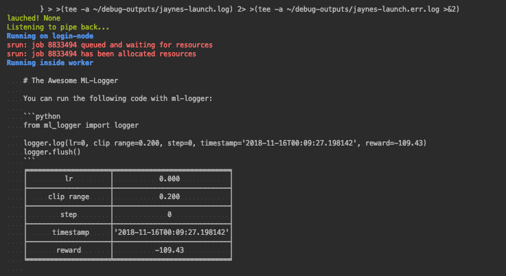
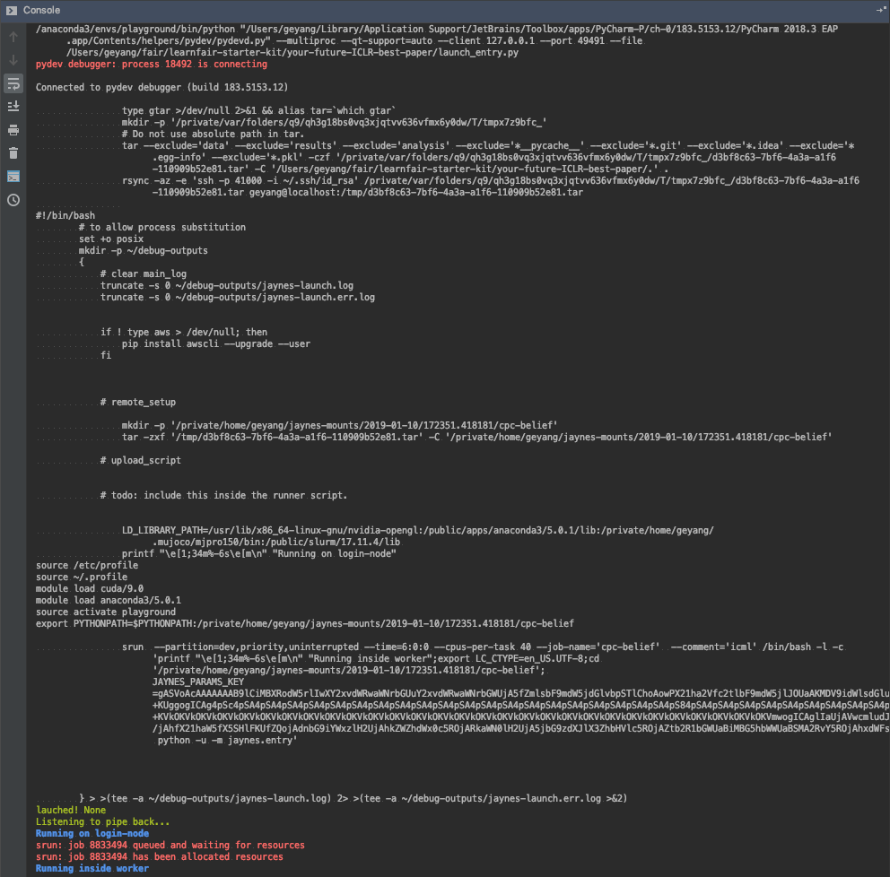

# LearnFAIR Cluster Starter Kit (with Jaynes [](http://pepy.tech/project/jaynes)️) <a href="https://github.com/episodeyang/jaynes" target="_blank"></a>

[](http://hits.dwyl.io/fairinternal/learnfair-starter-kit)

This kit contains a **minimal example project** for launching and monitoring
ML jobs on the FAIR cluster.

## Getting Started with [./Makefile](./Makefile)

Here is a simple `Makefile` that makes it easy to 
1. setup local tunnel
2. connect pyCharm to this local tunnel

The Penguine! cluster requires 2-factor authentication (2FA) to login. You want
to setup a local tunnel so that you only need to do 2FA once.

The tunnel binds a local port to a persistent ssh connection to your dev server.
Then you can ssh to this local port (41000 in this folder) without having to type 
in the password and the security code.

**Take a look at the Makefile**, add your username and the ip address of your 
assigned learnfair dev machine. Then run:
```bash
# inside `learnfair-starter-kit/.`
make tunnel
```

Then it should look like the following:

<p align="center">

</p>

> To add your username and machine ip address, open up an editor (`vim Makefile` 
> for example) and:
> 1. replace the `<your-username>` with your username
> 2. replace `<your-dev-machine-ip>` with your actual dev machine ip.
> 2. replace `<your-rsa-key-no-pub-postfix>` with your actual key file. you can remove this option if you have a default key

### Check Your SSH Tunnel

To check your tunnel connection, try to ssh connect to your dev machine through
your local tcp-forwarded port. Run
```bash
make ssh-local
```
**Again, make sure you fill in your login node's ip address in the Makefile!**

Now with this you should be able to log into your login node!

<p align="center">

</p>

### Adding your `rsa_id` to jumphost (and devfair)

In order to build the tunnel and login without having to type in your password, you need to do the following:

1. generate and copy `id_rsa` file on your mac to jumphost
2. copy `id_rsa` file from your mac to your dev machine
3. generate and copy `id_rsa` file on jumphost to your dev machine

On each machine, 

1. change permission of `~/.ssh` recursively to `600`
2. add the key to ssh by `ssh-use -i ~/.ssh/<your-key-no-pub>`

Then on your devfair machine, change the ssh daemon configuration to allow `PubliKeyAuthentication yes`
and restart the service.

```
# /etc/ssh/sshd_config
UsePAM yes
PubkeyAuthentication yes
```

### More Info 

There is another script `make tunnel-background` that established the tunnel
as a background thread. However b/c roaming can break the ssh session,
it is easier to have the tunnel process in the foreground. So that it is easy
to kill it by `ctrl-D`.

To kill a background tunnel that is unresponsive, run `make kill-all-tunnels`.

## Launching your local python codebase on LearnFAIR with [`Jayens`](https://github.com/episodeyang/jaynes)

`jaynes` is a cloud agnostic ML launch tool. This project contains a minimum example for launching training
jobs on `learnfair`, from the comfort of your favorite IDE.

The example project here is called [./your-future-ICLR-best-paper](your-future-ICLR-best-paper). Inside, 
there is a `jaynes.yml` configuration file. This is the config file for your `jaynes` launcher. it specifies
which python package (directory) we want to upload, how (ssh/aws s3 etc), and what to do once 
you are inside the host.

```bash
➜ tree your-future-ICLR-best-paper 

your-future-ICLR-best-paper
├── jaynes.yml
└── launch_entry.py

0 directories, 2 files
```

### Fill-in Your Username

To launch jobs, we need to put in your username for the ssh connection. Take a 
look at the `jaynes.yml` file, and do the following:

1. replace all `<your-username>` with, well, your lovely username!

### What is Jaynes?

`Jaynes` is an open-source tool for launching ML training jobs on heterogeneous compute platforms. It has a 
minimal foot-print--the only thing you need is a `jaynes.yml` config file under the root of your
project repo, the same way `.gitconfig` is for your git repo.

Jaynes allows you to launch hundreds :100: of hyper-parameter runs within seconds, all from the comfort of your IDE. 
Because it requires no change to your code, you can run the same code locally in a debugger and as a 
remote SLRM job.

This represents the most delightful developer experience for ML job launching at the moment. 

- No more stale code on your cluster servers
- Version-controlled runs as tar-balls (supports S3 buckets)
- Sweep hyper-parameters with a simple python for-loop.
- Easily switch between AWS, your own server via SSH, and different SLURM clusters.



### Install Jaynes (and the awesome ML-Logger)

Now, you can try to run the [./your-future-ICLR-best-paper/launch_entry.py](./your-future-ICLR-best-paper/launch_entry.py)
after installing `jaynes`. Jaynes works even better when you can log everything to a single "instrumentation server"!
This is why we also install [ML-Logger](https://github.com/episodeyang/ml_logger).

```bash
pip install jaynes ml-logger
```

### Now Profit!!

Now you can run the [launch_entry.py](./your-future-ICLR-best-paper/launch_entry.py) script. In pycharm and VS Code, 
this means that you can pick any python script in your code base, and run it in-place by just calling:

```python
import jaynes

jaynes.run(your_python_function, *args, **keyword_args)
```

The local and remote script that `jaynes` generates using this configuration 
look like the following:


