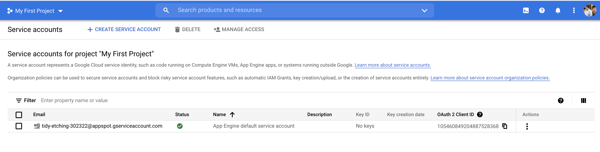

# Launching On GCP with Jaynes and Docker

This folder contains a working example for launching jobs on the Google Cloud Platform (GCP) with docker containers. At the end of the day, you would have 1. a python script and 2. a simple `.jaynes` script that allows you to scale your experiment instantly to thousands of instances on the GCP.

**Example script:**

```python
import jaynes
from your_project import train, Args

for seed in [100, 200, 300]:
    jaynes.config(name=f"demo-instance/seed-{seed}")
    jaynes.run(train, seed=seed)
```

**Note**: The example config currently uses an a GCP bucket for the code mount. To use an S3 code mount, one would need to add AWS key/screte pairs as environment variables in the `launch.startup` field.

## Before You Begin

The Google compute engine (GCE) is the EC2 equivalent under the Google Cloud Platform (GCP). The Google storage (GS) is the S3 equivalent. 

**There are two GCE accounts. The first is what you use to launch instances. This is the default GCE service account.** The second is a service account you setup for the VM workers. This second account does not have the permission to launch instances. Below, we are talking about the _first account_, that you use to launch instances.

### Step 1: Setting up Google Cloud API access via the **default** service acount

You need to first create a service account for managing and launching GCE resources with the CLI tool. Do so by 

1. First, create a new service account called `ge-jaynes-<labname>`
2. CLick on this entry, then click on "Create New Key"
3. Download that key to your local machine at `~/.gce/<gce-org-name>-<id>-1234567891234.json`, or something alike
4. Set up you environment variables as the following:
    ```bash
    # environment variables for Google Compute Engine
    export GOOGLE_APPLICATION_CREDENTIALS=$HOME/.gce/<gce-org-name>-<id>-1234567891234.json
    ```
   
**To Test Your Setup**, first add this to your `~/.profile`:
```bash
export JYNS_GCP_PROJECT=<your-gcp-project-name>
```
Then run
```bash
gcloud compute instances create test-debug-ge-7 \
   --project $JYNS_GCP_PROJECT \
   --zone us-west4-b \
   --machine-type n1-standard-4 \
   --maintenance-policy TERMINATE --restart-on-failure \
   --image-family tf2-ent-2-3-cu110 \
   --image-project deeplearning-platform-release \
   --boot-disk-size 200GB \
   --metadata "install-nvidia-driver=True,proxy-mode=project_editors" \
   --scopes https://www.googleapis.com/auth/cloud-platform \
--accelerator type=nvidia-tesla-t4,count=1
```

### Step 2: Adding the **default** _compute service_ account to the storage bucket

The virtual machines access GCP resources via a service account. The default service account is called "Compute Engine default service account". In order for the VMs to access the google storage bucket, you need to add the service account to the bucket. When using Jaynes, the VM needs access to the GS bucket in order to download the code payload. 

A typical error is for machines to have no access to the google storage bucket, therefore unable to download the code mounts and other payloads. The error typically looks like this when the launch script runs inside the VM:

```bash
$ gsutil cp gs://geyang-jaynes-improbable-ai/jaynes-debug/c86d66df-4017-460e-bf69-28b82543e3d0.tar /tmp/c86d66df-4017-460e-bf69-28b82543e3d0.tar

AccessDeniedException: 403 1045709174286-compute@developer.gserviceaccount.com does not have storage.objects.list a
ccess to the Google Cloud Storage bucket.
```

#### The Fix: Adding the service account to the bucket

To allow your virtual machines to access the google storage, you would need to add the service account to the google storage bucket. 

1. **Find the name of the compute service account** by going to [IAM & Admin] > [Service Accouonts] and find the [Compute Engine Default Service Account] in the list below:

   

2. **Adding the service account IAM to the bucket**: via

	```bash
	gsutil iam ch serviceAccount:1234567890123-compute@developer.gserviceaccount.com:roles/storage.objectViewer gs://geyang-jaynes-improbable-ai
	```

#### Storage Role Overview

Storage Object Viewer (`roles/storage.objectViewer`) includes these permissions:

```text
resourcemanager.projects.get
resourcemanager.projects.list
storage.objects.get
storage.objects.list
```

### Step 3: Installing `jaynes`

You need to have `gcloud` and `gsutil` installed on your computer, as well as `jaynes`. 

```bash
pip install jaynes
```

### Step 4: Installing the Cloud SDK (Google)

Then install and configure your `gcloud` and `gsutil` command line utilities according the these guides:

- install the cloud SDK (`gcloud`):  https://cloud.google.com/sdk/docs/install
- Install `gsutil`: https://cloud.google.com/storage/docs/gsutil_install
- [Set a default region and zone](https://cloud.google.com/compute/docs/gcloud-compute#set_default_zone_and_region_in_your_local_client).

Now after you have finished, you can verify that your cloud SDK is working via:

```bash
$ gcloud auth list
```

which should print out:

```
Credentialed Accounts
ACTIVE ACCOUNT
     * your-email@gmail.com
       your-other-email@gmail.com
```

To set the active account, run:

```
$ gcloud config set account <account>
```

### Step 4: Setting Up Access for VM workers to upload to Google Storage

**This is the second account type mentioned before**. This service account can not launch instances.

In order to access google storage from within docker instances running inside a virtual machine, you need to setup a disposible service IAM with access limited to just read and write to the bucket. For details, follow the guide here: [[Setting Up Google Storage Service Account]](./setting_up_gcp_service_account.md).

## Mental Model for Using Multiple GCP Accounts

Typically, if you sign up to multiple organizations using the same email, you can distinguish between accounts via projects. Each project has its own billing and organizational affiliation. The google cloud api python module is separate from the `gcloud` command line utility when it comes to managing confugrations for different projects. Therefore you need to double check what project `gcloud` and `gsutil` is using. Suppose you want to setup a service account for accessing the gs bucket in one project, but your `gcloud` utility is using a different active configuration, you might inadvertly create an account under that project instead.

### Environment Variables for Google Cloud Python API and Jaynes

Jaynes uses the google cloud api python module internally. I typically setup the following environment variables in my `~/.profile` , 

```bash
# environment variables for Google Compute Engine
export JYNS_GCP_PROJECT=lab-mit-1234
export GOOGLE_APPLICATION_CREDENTIALS=$HOME/.gce/<gce-org-name>-<id>-1234567891234.json

export JYNS_GS_BUCKET=some-bucket-lab-mit
# export JYNS_GCP_PROJECT=some-org-1234
# export GOOGLE_APPLICATION_CREDENTIALS=$HOME/.gce/some-org-1234-somehash.json
```

Note that each project would require a different application credentials `json` file.


## Machine Learning At Scale with `jaynes` on GCP

The following are supported in `jaynes>=v0.7.7` and above. See https://pypi.org/project/jaynes/0.7.7/

### Part 1: Creating A GCP Bucket for Your Code and Data

**Important Note:** the prefix, `gs://` is required for `gsutil cp` to target the Google storage (GS) bucket as opposed to your local file system. For this reason, the `GSCode` mount type in jaynes also requires that prefix. Otherwise you might copy locally as opposed to sending it to the bucket.

First make sure that you are able to run the `gsutil` command. Now, create two buckets using the following command:

```bash
gsutil mb gs://$USER-jaynes-$ORGANIZATION
gsutil mb gs://$USER-data-$ORGANIZATION
```

If you mess up, remember even if you delete a bucket, it would take a while for its name to be released, so that you can recreate it using different settings. Just don't panic!

```shell
gsutil rb gs://$USER-jaynes-$ORGANIZATION
gsutil rb gs://$USER-data-$ORGANIZATION
```

#### Using AWS S3 with GCP instances

The `aws cli` is not pre-installed on the machine learning GCP VM images. Therefore to download from AWS S3, you need to install the commandline tool as part of the `setup` step of your `.jaynes.runner` configuration. 

```yaml
launch: !ENVS
  setup: pip install -q awscli jaynes ml-logger params-proto
```

To reuse the S3 code mount, you can copy and pasting the `S3Mount` config from the AWS tutorial into this `.jaynes.yml` config, to replace the existing mount. Make sure that you follow the [AWS tutorial first](02_ec2_docker_guide).


### Part 2: Double-Check Your Environment Variables

google.auth.exceptions.DefaultCredentialsError: Could not automatically determine credentials. Please set GOOGLE_APPLICATION_CREDENTIALS or explicitly create credentials and re-run the application. For more information, please see https://cloud.google.com/docs/authentication/getting-started

you need to have these in your [~/.profile](file://~/.profile).

```bash
#~/.profile

# environment variables for Google Compute Engine
export GOOGLE_APPLICATION_CREDENTIALS=$HOME/.gce/<your-project>.json
export JYNS_GCP_PROJECT=<your-project-id-1234>
export JYNS_GS_BUCKET=<your-bucket-name>
```

### Part 3: Docker Image

We include an example docker image in the [./docker/Dockerfile](./docker) file. If you are using your own docker image, you need either pre-package `jaynes`, or install `jaynes` via `RUN pip install jaynes` during setup, to make available the jaynes entry script.

### Part 4: Launch!

Now the launch is as simple as running

```bash
python launch_advanced.py
```

Remember, turn on the  `verbose=True` flag, to see the script being generated and details of the request.

### Common Errors

- How to debug: you set `launch.termination` to `false`, so that the machines would not terminate after the startup script finishes running. This way you can `ssh` into the VM, and debug by copy and pasting the script generated in `verbose=True` mode, to debug the launch step by step.

- error: **name already exists**: This means that the name you are using already exists as an VM instance. You should use a different instance name.

- **\$HOME directory in GCE VM instances** depends on the user that is logging in. You can just `ubuntu` as a generic user name so that we can share the same `.jaynes.yml` configuration file between multiple users.

- **gsutil import error** can occur when you use `jaynes` with pyCharm, where `gsutil` uses a wrong python binary that contains outdated versions of cloud sdk dependencies. A typpical error looks like the following:

  ```shell
  Traceback (most recent call last):
    File "/Users/dario/Downloads/google-cloud-sdk/bin/bootstrapping/gsutil.py", line 13, in <module>
      import bootstrapping
    File "/Users/dario/Downloads/google-cloud-sdk/bin/bootstrapping/bootstrapping.py", line 32, in <module>
      import setup  # pylint:disable=g-import-not-at-top
    File "/Users/dario/Downloads/google-cloud-sdk/bin/bootstrapping/setup.py", line 55, in <module>
      from googlecloudsdk.core import properties
    File "/Users/dario/Downloads/google-cloud-sdk/lib/googlecloudsdk/core/properties.py", line 34, in <module>
      from googlecloudsdk.core.util import times
    File "/Users/dario/Downloads/google-cloud-sdk/lib/googlecloudsdk/core/util/times.py", line 55, in <module>
      from dateutil.tz import _common as tz_common
  ImportError: cannot import name _common
  ```

  To fix this, you just need to specify the `CLOUDSDK_PYTHON`  version

  ```
  export CLOUDSDK_PYTHON=<what-ever-python-distro-you-want>
  ```

  This is documented in this SO reply: https://stackoverflow.com/a/69232033/1560241


## Config Examples and Values

Here is an example of the GS based code mount.

**Important Note:** the prefix, `gs://` is required for `gsutil cp` to target the Google storage (GS) bucket as opposed to your local file system. For this reason, the `GSCode` mount type in jaynes also requires that prefix. Otherwise you might copy locally as opposed to sending it to the bucket.

**Important Note 2:** GCP instances tend to use your email as the username, which makes guessing the file path a bit tricky. We can use local environment variables in the path to avoid having to specify those paths manually. This also makes the generated script username agnostic, hence easier to use during debugging. 

```python
mounts:
  - !mounts.GSCode
    prefix: "gs://{env.JYNS_AWS_S3_BUCKET}/model-free"
    local_path: "$HOME/.mujoco/mjkey.txt"
    host_path: "$HOME/jaynes-mounts/{now:%Y-%m-%d}/{now:%H%M%S.%f}/mjkey.txt"
    container_path: /root/.mujoco/mjkey.txt
    compress: true
```


Here is an example configuration for launching via the Google Compute Engine (GCE) service:

```yaml
launch: !ENV
    type: gce
    launch_dir: /home/ec2-user/jaynes-mounts
    project_id: "{env.JYNS_GCP_PROJECT}"
    zone: us-east1-b
    image_project: deeplearning-platform-release
    image_family: pytorch-latest-gpu
    instance_type: n1-standard-1
    accelerator_type: 'nvidia-tesla-k80'
    accelerator_count: 1
    preemptible: true
    terminate_after: true
    tags:
      # needed to install silently. Needs sleep at startup, otherwise may fail.
      install-nvidia-driver: True
```

For the `instance_type`, you can only attach GPUs to [general-purpose N1 VMs](https://cloud.google.com/compute/docs/general-purpose-machines#n1_machines) or [accelerator-optimized A2 VMs](https://cloud.google.com/compute/docs/accelerator-optimized-machines#a2_machines). GPUs are not supported by other machine families. 


## Important Notes

1. **How Do I install Nvidia Drivers?** the deep learning images require manual confirmation to install the nvidia drivers on the first log in. To install silently, you need to enable the `install-nvidia-driver` tag. All tag values are string type, so using boolean True fails. For this reason, in the `gce` mode of Jayens, we cast the tag values into string type, so that you don't have to be aware of this.
2. **Why does my nvidia-docker fail with `driver can not be loaded`?**  you can add a `sleep 60` after the initial bootup, to give it some time. 


### general purpose machine types 

The cpu count comes in powers of 2:

| Machine types    | vCPUs1 | Memory (GB) |
| :--------------- | :----- | :---------- |
| `n1-standard-1`  | 1      | 3.75        |
| `n1-standard-2`  | 2      | 7.50        |
| `n1-standard-4`  | 4      | 15          |
| `n1-standard-8`  | 8      | 30          |
| `n1-standard-16` | 16     | 60          |
| `n1-standard-32` | 32     | 120         |
| `n1-standard-64` | 64     | 240         |
| `n1-standard-96` | 96     | 360         |

1. A vCPU is implemented as a single hardware Hyper-thread on one of the available [CPU platforms](https://cloud.google.com/compute/docs/cpu-platforms).
2. Persistent disk usage is charged separately from [machine type pricing](https://cloud.google.com/compute/vm-instance-pricing).

For the `accelerator_type`, you can choose between the following gpus:

| value           | Details    |
| --------------- | ---------- |
| `nvidia-tesla-t4` | NVIDIA® T4 |
|`nvidia-tesla-t4-vws` | NVIDIA® T4 Virtual Workstation with NVIDIA® GRID® |
|`nvidia-tesla-p4` | NVIDIA® P4 |
|`nvidia-tesla-p4-vws` | NVIDIA® P4 Virtual Workstation with NVIDIA® GRID® |
|`nvidia-tesla-p100` | NVIDIA® P100 |
| `nvidia-tesla-p100-vws` | NVIDIA® P100 Virtual Workstation with NVIDIA® GRID® |
| `nvidia-tesla-v100` | NVIDIA® V100 |
| `nvidia-tesla-k80`| NVIDIA® K80  |

### accelerator optimized A2 types

comes in a 12:1 vCPU/A100 ratio. A2 VMs are only available on the [Cascade Lake platform](https://cloud.google.com/compute/docs/cpu-platforms).

| Machine types    | vCPUs1 | Memory (GB) |
| :--------------- | :----- | :---------- |
| `a2-highgpu-1g`  | 12     | 85          |
| `a2-highgpu-2g`  | 24     | 170         |
| `a2-highgpu-4g`  | 48     | 340         |
| `a2-highgpu-8g`  | 96     | 680         |
| `a2-megagpu-16g` | 96     | 1360        |


## Pricing

### NVIDIA GPUs

| **Model**                                                    | **GPUs** | **GPU memory** | **GPU price (USD)** | **Preemptible GPU price (USD)** | **1 year commitment price (USD)** | **3 year commitment price (USD)** |
| :----------------------------------------------------------- | :------- | :------------- | :------------------ | :------------------------------ | :-------------------------------- | :-------------------------------- |
| [NVIDIA® A100](https://www.nvidia.com/en-us/data-center/a100/) | 1 GPU    | 40 GB HBM2     | \$2.933908 per GPU   | \$0.8801724 per GPU              | \$1.84836204 per GPU               | \$1.0268678 per GPU                |
| [NVIDIA® Tesla® T4](https://www.nvidia.com/en-us/data-center/tesla-t4/) | 1 GPU    | 16 GB GDDR6    | \$0.35 per GPU       | \$0.11 per GPU                   | \$0.220 per GPU                    | \$0.160 per GPU                    |
| [NVIDIA® Tesla® P4](https://www.nvidia.com/en-us/deep-learning-ai/inference-platform/hpc/) | 1 GPU    | 8 GB GDDR5     | \$0.60 per GPU       | \$0.216 per GPU                  | \$0.378 per GPU                    | \$0.270 per GPU                    |
| [NVIDIA® Tesla® V100](https://www.nvidia.com/en-us/data-center/tesla-v100/) | 1 GPU    | 16 GB HBM2     | \$2.48 per GPU       | \$0.74 per GPU                   | \$1.562 per GPU                    | \$1.116 per GPU                    |
| [NVIDIA® Tesla® P100](https://www.nvidia.com/object/tesla-p100.html) | 1 GPU    | 16 GB HBM2     | \$1.46 per GPU       | \$0.43 per GPU                   | \$0.919 per GPU                    | \$0.657 per GPU                    |
| [NVIDIA® Tesla® K80](https://www.nvidia.com/en-gb/data-center/tesla-k80/) | 1 GPU    | 12 GB GDDR5    | \$0.45 per GPU       | \$0.135 per GPU                  | \$0.283 per GPU                    | $0.92 per GPU |

### NVIDIA® GRID® Virtual Workstation GPUs

| **Model**                                                    | **GPUs** | **GPU memory** | **GPU price (USD)** | **Preemptible GPU price (USD)** | **1 year commitment price (USD)** | **3 year commitment price (USD)** |
| :----------------------------------------------------------- | :------- | :------------- | :------------------ | :------------------------------ | :-------------------------------- | :-------------------------------- |
| [NVIDIA® Tesla® T4 Virtual Workstation](https://www.nvidia.com/en-us/design-visualization/technologies/virtual-gpu/) | 1 GPU    | 16 GB GDDR6    | \$0.55 per GPU       | \$0.31 per GPU                   | \$0.42 per GPU                     | \$0.36 per GPU                     |
| [NVIDIA® Tesla® P4 Virtual Workstation](https://www.nvidia.com/en-us/design-visualization/technologies/virtual-gpu/) | 1 GPU    | 8 GB GDDR5     | \$0.80 per GPU       | \$0.416 per GPU                  | \$0.578 per GPU                    | \$0.47 per GPU                     |
| [NVIDIA® Tesla® P100 Virtual Workstation](https://www.nvidia.com/en-us/design-visualization/technologies/virtual-gpu/) | 1 GPU    | 16 GB HBM2     | \$1.66 per GPU       | \$0.63 per GPU                   | \$1.119 per GPU                    | \$0.857 per GPU                    |


# N1 Standard Machine Type Pricing

Below is the price in Iowa (us-central-1). Prices in other regions are similar.

| Machine type   | Virtual CPUs | Memory | Price (USD) | Spot price* (USD) |
| -------------- | ------------ | ------ | ----------- | ----------------- |
| n1-standard-1  | 1            | 3.75GB | $0.04749975 | $0.01             |
| n1-standard-2  | 2            | 7.5GB  | $0.0949995  | $0.02             |
| n1-standard-4  | 4            | 15GB   | $0.189999   | $0.04             |
| n1-standard-8  | 8            | 30GB   | $0.379998   | $0.08             |
| n1-standard-16 | 16           | 60GB   | $0.759996   | $0.16             |
| n1-standard-32 | 32           | 120GB  | $1.519992   | $0.32             |
| n1-standard-64 | 64           | 240GB  | $3.039984   | $0.64             |
| n1-standard-96 | 96           | 360GB  | $4.559976   | $0.96             |


## Further Readings on GCP VM with Accelerators

To create a VM with attached GPUs, complete the following steps:

1. Create the VM. The method used to create a VM depends on the GPU model.
   - To create a VM with A100 GPUs, see [Creating VMs with attached GPUs (A100 GPUs)](https://cloud.google.com/compute/docs/gpus/create-vm-with-gpus#create-new-gpu-vm-a100).
   - To create a VM with any other available model, see [Creating VMs with attached GPUs (other GPU types)](https://cloud.google.com/compute/docs/gpus/create-vm-with-gpus#create-new-gpu-vm).
2. For the VM to use the GPU, you need to [install the GPU driver on your VM](https://cloud.google.com/compute/docs/gpus/install-drivers-gpu).
3. If you enabled NVIDIA® GRID virtual workstations, [install GRID® drivers for virtual workstations](https://cloud.google.com/compute/docs/gpus/install-grid-drivers).


## Notes on Traning Speed

Now with the `chaining` mode added to jaynes, we have a way to pack multiple jobs onto the same GPU/VM instance.

Using the pytorch SAC code base, here are the rough number of inference speed for different hardwares and amount of parallelization. This shows that V100 is by far 4x faster than the T4 that we use for inference, and we can pack 5x more jobs on the V100 and still run faster for the entire batch, in comparison to the GCP T4 instances.

In the future we want to experiment with packing multiple runs in T4 and see how it impacts the wall time.


**V100**

| **Parallelization** | **Time/Episode** | **Wall Time (hours)** |
| ------------------- | ---------------- | --------------------- |
| 1                   | 6.7              | 1.86                  |
| 2                   | 9                | 2.50                  |
| 4                   | 13               | 3.61                  |
| 5                   | 19               | 5.28                  |
| 8                   | 24               | 6.67                  |
| 10                  | 50               | 13.89                 |

**T4**

| **Parallelization** | **Time/Episode** | **Wall Time (hours)** |
| ------------------- | ---------------- | --------------------- |
| 1                   | 20               | 5.56                  |
|                     |                  |                       |


| dt episode | (env=quadrauped): |          
| ---------- | ----------------- |    
| 1 process: | 11.2sec           |
| 2 process: | 20.3sec           |
| 5 process: | 49.4sec           |
