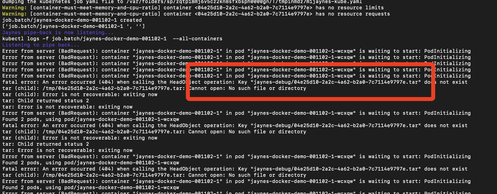
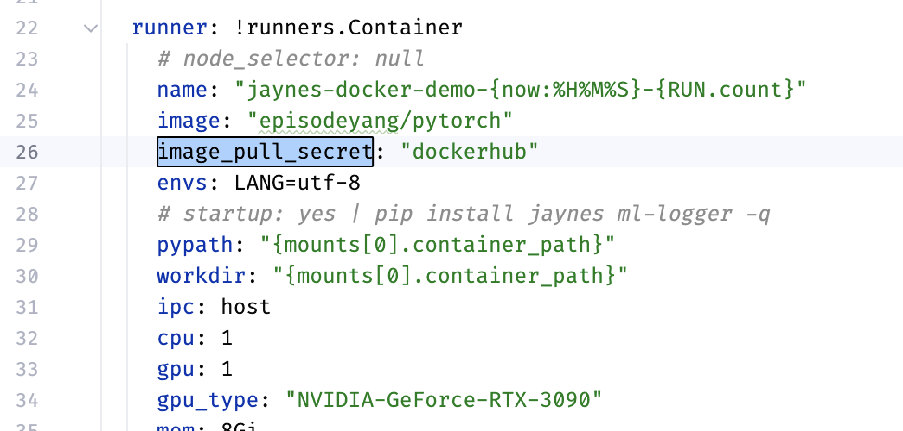

# Jaynes Guide for Kubernetes

This tutorial contains a working example of using `jaynes` to launch multiple jobs on a kubernetes cluster.

## Authenticating with Kubernetes

From the cluster admin, you should be able to obtain a `config` file. Nautilus users can find it in [this link](https://portal.nrp-nautilus.io/authConfig).

You should place this file at `~/.kube/config`.

```bash
mv ~/Downloads/config ~/.kube/config
```

After this, your `kubectl` should just work. Try:

```bash
kubectl get pods
```

## Quick Start

### Setting Up S3 access on AWS

This jaynes tutorial uses a publicly accessible S3 bucket for uploading and downloading the code snapshot. At this moment we do not support custom endpoints or private buckets. PRs on this are welcome.

To set up the S3 bucket, go to Amazon's AWS console, create a bucket (e.g., named **your-public-bucket**) that explicitly *unblocks* public accesses with ACL (access control list) enabled, then edit the access
to give *all AWS users list/read access*.

Run the following commands to set up a prefix handle to store generic jaynes file, and to test access

```bash
aws s3 ls s3://your-public-bucket/
touch test.txt
aws s3 cp ./test.txt s3://your-public/bucket/jaynes-debug/test_co.txt
aws s3 ls s3://your-public-bucket/jaynes-debug/
```

### Configure AWS access for remote hosts

This is a self-contained example that should work out of the box. First, make sure that your S3 bucket is setup correctly:  Make a copy of the `.secret.template.yml` -> `.secrete.yml` file in this example project. Edit this secret file, to include your S3 bucket name

```bash
mv .secret.template.yml .secret.yml
vim .secret.yml
```

The `.secret.yml` should look something like this,

```
JYNS_AWS_S3_BUCKET: your-public-bucket  # put your bucket name here
```

### Configure kubectl namespace

Change the namespace placeholder `<YOUR NAMESPACE HERE>` in `.jaynes.yml` to match the namespace in your `~/.kube/config`.

### Configuring dockerhub access for kubectl

As of 2022, dockerhub now require login for pulling images. You will encounter errors with pod initialization if you do not set up dockerhub login correctly.



To set up dockerhub access
1. first register an account at [DockerHub](). 
2. Create a personal token. 
3. Then create a secret using the following command with a name `<secret-name>`. 

    ```bash
    kubectl create secret docker-registry dockerhub \
       --docker-server=docker.io \
       --docker-username=<your-docker-hub-user-name> \
       --docker-password “<dckr_pat_your_personal_token>” \
       --docker-email <your_dockerhub_email>
    ```
4. Place the name of your generated secret under `image_pull_secret` field in [`.jaynes.yml`](.jaynes.yml).

    

## Test single-pod running

Run

```bash
python launch_entry.py
```

If it works, you will see logs similar to this

```
Error from server (BadRequest): container “jaynes-docker-demo-010226-1” in pod “jaynes-docker-demo-010226-1-kt2hf” is waiting to start: PodInitializing

# This error keeps repeating itself until the pod is initialized....

download: s3://roger-public/jaynes-debug/d9279148-e827-4158-b43f-8beb4ef8f2d9.tar to tmp/d9279148-e827-4158-b43f-8beb4ef8f2d9.tar
Running inside worker jaynes-docker-demo-010226-1-kt2hf
Training model...
seed: 100
Done!
```

## Test multi-pod running

For an example that launches multiple pods, where multiple training jobs runs within each pod, you can look at 

```bash
python launch_chained_entries.py
```

```python
from time import sleep


def train_fn(seed=None):
    from ml_logger import logger

    sleep(1)
    if seed:
        print(f"{logger.slurm_job_id} seed={seed}")
    else:
        print('done.')


if __name__ == "__main__":
    import jaynes

    jaynes.config()
    jaynes.add(train_fn, seed=100) \
        .chain(train_fn, seed=200) \
        .chain(train_fn, seed=300) \
        .chain(train_fn, seed=400) \
        .chain(train_fn, seed=500)
    jaynes.add(train_fn, seed=600) \
        .chain(train_fn, seed=700) \
        .chain(train_fn, seed=800) \
        .chain(train_fn, seed=900) \
        .chain(train_fn, seed=1000)
    jaynes.execute()
    jaynes.listen()
```

## Detailed Setup Guide

### Kubernetes Examples

The [kube_examples](kube_examples) folder contains examples of working kube job config files. For details of the setup and a simple tutorial, refer to https://ucsd-prp.gitlab.io. They offer a very nice collection of examples.

### Getting a list of GPU Types

```bash
kubectl get nodes -L nvidia.com/gpu.product
```

## How To Debug

Use `desribe` to inspect the error messages.

```bash
kubectl describe pods <pod-id>
```
